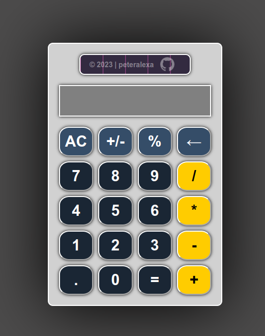

# Calculator Web Application

This is a straightforward calculator web application built for The Odin Project's Calculator assignment. The app enables users to perform basic arithmetic operations, supporting decimal numbers and percentage calculations.

## Live Preview

Explore the live preview of the calculator [here](https://peteralexa.github.io/top-calculator/).

  

## Usage

### Mouse Click:

- Click the number buttons to input numbers.
- Click the operator buttons to select the operation.
- Click the equals button (=) to perform the calculation.
- Click the decimal button (.) to input decimal points.
- Click the percentage button (%) to activate percentage calculation mode.
- Click the clear button (AC) to clear the current calculation.
- Click the backspace button (←) to delete the last digit.

### Keyboard Input:

- Use numeric keys to input numbers.
- Use the "+" key for addition, "-" key for subtraction, "*" key for multiplication, "/" key for division, and "%" key for percentage calculations.
- Use the Enter key to perform the calculation.
- Use the Escape key to clear the current calculation.
- Use the Backspace key to delete the last digit.

### Percentage Calculation:

The calculator provides a convenient way to perform percentage calculations. Here's how to use the percentage mode:

1. **Input Percentage Number (A):**
   - Input the percentage number (A) that you want to calculate.

2. **Activate Percentage Mode:**
   - Click the percentage button (%) or use the "%" key to activate percentage calculation mode.

3. **Input Base Number (B):**
   - Input the base number (B) for which you want to find the percentage.

4. **Perform Calculation:**
   - Click the equals button (=) or use the Enter key to obtain the result.

#### Example:

Suppose you want to calculate 8% of 250:

1. Click or type '8%' to input the percentage number (A).
2. Click or type '250' to input the base number (B).
3. Click '=' or use the Enter key to obtain the result.

The display will show the result, which is 8% of 250.
